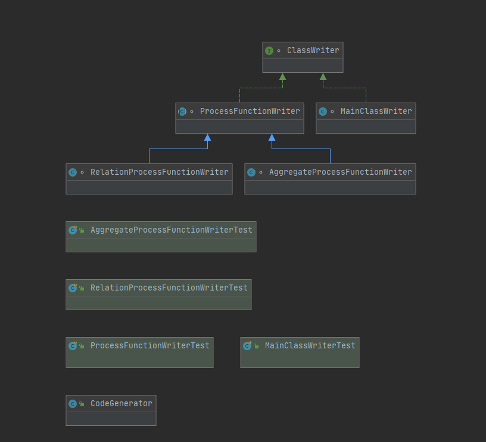
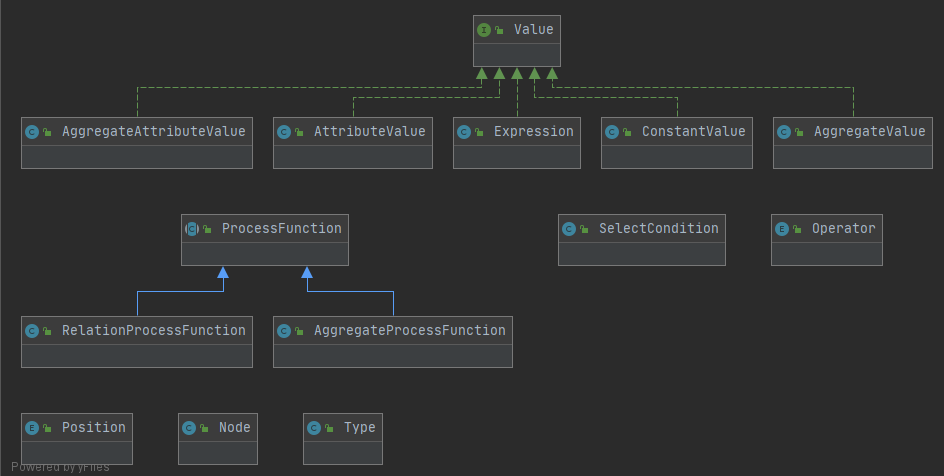
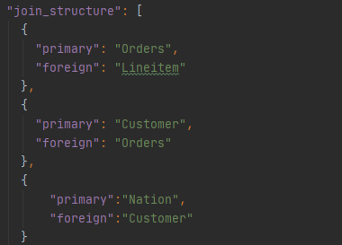
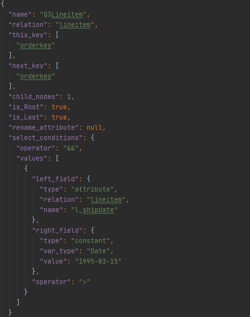
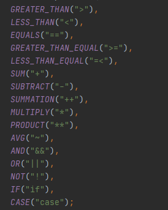

# Code Generator
This component generates the code for a given json representation of a query and generates code corresponding to it. That code is then submitted to a flink cluster to run.

## Packages
The code is divided in to the following packages:
* checkerutils: this package is where generic sanity checks go
* codegenerator: this is where the actual generation happens.
Below is the structure:

* jsonutils: This is where the parsing of the input json happens and returns a Node object.
* objects: These are the domain objects. Most of these objects are made as a result of parsing the input json file. The most important object is Node, an instance of it represents a query and it has these object: List<RelationProcessFunction> relationProcessFunctions, List<AggregateProcessFunction> aggregateProcessFunctions and Map<Relation, Relation> joinStructure.
Below is the class diagram for this package:

* schema
This package describes the TPCH schema. The most important class is the RelationSchema class as it makes the actual relations used in the supported relations.

The annotations package has a collection of annotations for the developers to communicate with each other and is not functional, all annotations are for source files only.

The main class is the CodeGen class and is responsible for parsing the input arguments and passing them to the relevant classes.

## Usage
There is a total of 5 compulsory arguments, which are, in order:
1. The path to the json file
1. The path to put the generated code's jar
1. The path of the input to the generated code
1. The path of the output of the generated code
1. The I/O type of the generated code, there are 2 options: "file" and "kafka"

## Contributing
The master branch is protected and pushing to it is not possible. In order to contribute discuss with the team the new idea and make a corresponding jira story ticket with the proper description, then make a branch with the same jira id (e.g. GCG-XX) and raise a pull request and ask Qichen to review and merge it. Testing evidence must be provided for the branch to be merged.

Make sure to follow basic software engineering practices e.g. SOLID principles, design patterns where possible (builder design pattern is used in more than one place already e.g. in Schema.java), avoid repetition and magic constants etc. and always have meaningful commit messages and always start a commit message with the jira ticket number e.g. GCG-XX. These practices pay off in the long run.

## Input json file
There are multiple examples of json files and their corresponding generated code in codegen/src/test/resources. Below is a description of the different parts of a json file.
There are 3 main segments in a json file:
### join_structure
This part described the parent child relationship between the relations involved in the query involved. E.g.

The relation corresponding to “primary” is the relationship with the primary key and the relation corresponding to “foreign” is the relation where that primary key is a foreign key.

#### RelationProcessFunction
This describes a relation process function, as the name suggests. 
The following are the fields:
* name: name of the relation process function class
* relation: name of the relation it represents
* this_key: the this key of the function
* next_key: the next key of the function
* child_nodes: the number of children of the relation process function, as per the join_structure above
* is_Root: whether the relation is root in the tree or not
* is_Last: whether the relation is last in the tree or not
* rename_attribute: whether any attributes need to be renamed in the result
* select_conditions: these are the conditions appearing after the WHERE clause in the sql for the query being described in the json. Select conditions are represented as a map and consist of the following fields:
    * 	operator: the operator binding multiple select conditions with each other e.g. where x = 1 AND y =2, here the operator is AND. Currently we force the operator to be AND (&&) operator, i.e., the user should rephase the select conditions into the form of Value_A AND Value_B AND Value_C AND ... .
    *	Values: these are the values of each select condition and is a list.

Here is an example:

#### AggregateProcessFunction
This represents the aggregate process function and has the following fields:
* name: the name of the aggregate process function class
* this_key: the this key of the functions
* output_key: the output key of the function
* AggregateValue: a list of all aggregations that should calculate in the aggregate process function.  Each aggregation contains the following fields:
    * Name: name of the aggregation
    * value: a value that represents the aggregation, usually an expression like l_extendedprice*(1-l_discount), also can be a value like 1/l_quantity
    * aggregation: the operator of the aggregation
    * Value_type: the value type of the value
Below is an example:

#### Operators
The below is a list of the supported operators, these operators are used in things like comparisons for select conditions:

#### Value semantics
Values is a type-marker interface that denotes the different kinds of values in the json. 

A value can be either a constant, an attribute or an expression, distinguish by the "type" field.  Here are example of values:
{ //constant value
  "var_type": "varchar",
  "type": "constant",
  "value": "BUILDING"
}
{ // attribute value
  "name": "c_mktsegment",
  "type": "attribute",
  "relation": "customer"
} 

An expression must represent a binary operator expression, such as add, minus, AND, OR, etc.  There will be four fields to represent an expression
*  left_field: a value that represents the left field of the expression.
*  right_field: a value that represents the right field of the expression.  Note the left field and right field can be another expression.
*  operator: the binary operator in the expression.
*  type: "expression", indicates the value is a expression. 

In SQL, more general operator like IN, CASE and NOT("!") is legal.  In Cquirrel, the IN expression will be expressed as multiple OR operators, and NOT("!") is currently not supported.  Users should rewrite the SQL or the json file to avoid NOT("!") operation, for example, evaluate the NOT("!") operators before writing it into the SQL. 

<s>There are currently 5 types of Values as shown in the objects package class diagram above.
 
AggregateProcessFunction values:
The Values prepended with “Aggregate” are means for AggregateProcessFunction values, used for aggregation:
* AggregateAttributeValue: This represents the output select condition on the aggregation result.
* AggregateValue: this represents the aggregation itself which can consist of another value and a name for the aggregate.

Generic values:

Attribute value represent a column in a table e.g. linenumber in lineitem and is described by the relation and column names.
Constant value represents a constant e.g. 10.1 which is a double type with value 10.1; and thus is described by the value itself and its data type.
An expression is a combination of a list of values and an operator that operates on them. Depending on the number of values in that list, there are certain operators allowed, not necessarily all:
* If the number of values is 1, then only the logical negation operator is allowed i.e. NOT(“!”).
* If the number of values is more than 2 then the allowed operators are AND(“&&”), OR(”||”) and CASE(“case”);
For any of the values if the inner value is described as expression, then the following list of values will go in an expression object, notice the “type” filed value is often expression in the above examples.</s>
